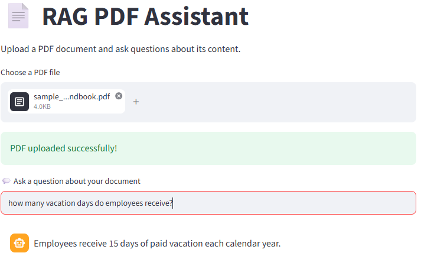

# RAG AI Chatbot

A Retrieval-Augmented Generation (RAG) chatbot that allows users to upload a PDF document and ask questions about its content.
## Demo
🔗 [Try the Live RAG PDF Assistant](https://rag-ai-chatbot-qps8szryddqbrthnasgreh.streamlit.app/)

## Features

- Upload and process PDF documents

- Split document text into smaller chunks

- Generate embeddings using Hugging Face

- Store and search embeddings using FAISS

- Retrieve relevant information based on the user's question

- Generate natural-language answers using OpenAI

- Interactive web interface built with Streamlit

## How It Works

PDF → Text → Text Chunks → Embeddings → FAISS Vector Store → Relevant Chunks → OpenAI → Answer

1. The user uploads a PDF.

2. The application extracts the text.

3. The text is divided into smaller chunks.

4. Hugging Face converts the chunks into embeddings.

5. FAISS stores and searches the embeddings.

6. The most relevant information is retrieved for the user's question.

7. OpenAI uses the retrieved information to generate an answer.

## Technologies Used

- Python

- Streamlit

- LangChain

- FAISS

- Hugging Face Sentence Transformers

- OpenAI API

## Example

**Question:** How many vacation days do employees receive?

**Answer:** Employees receive 15 days of paid vacation each calendar year.

## Project Purpose

This project demonstrates how Retrieval-Augmented Generation can combine document retrieval with a large language model to answer questions using information from a specific document.

## Skills Demonstrated

-Retrieval-Augmented Generation (RAG)
-PDF text extarction and preprocessing
-Text chunking and embeddings
-Vector similarity search with FAISS
-LLM integration with OpenAI
-Streamlit app development
-Git and GitHub version control
-Cloud deployment with Streamlit Community Cloud

## Run Locally
1. Clone the repository:

'''bash
git clone https://github.com/Birukecole21/rag-ai-chatbot.git
'''

2. Go into the poject folder:

'''bash 
cd rag-ai-chatbot
'''

3. Install the required packages: 

'''bash
pip install -r requirements.txt

4. create a '.env' file and add your OpenAI API key:

'''text
OPENAI_API_KEY=your_api_key_here
'''

5. Run the streamlit app:

'''bash
python -m streamlit run app.py
'''

